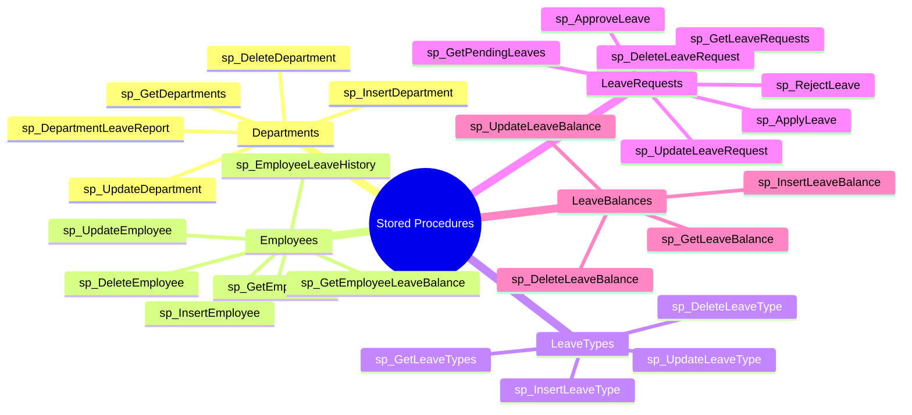
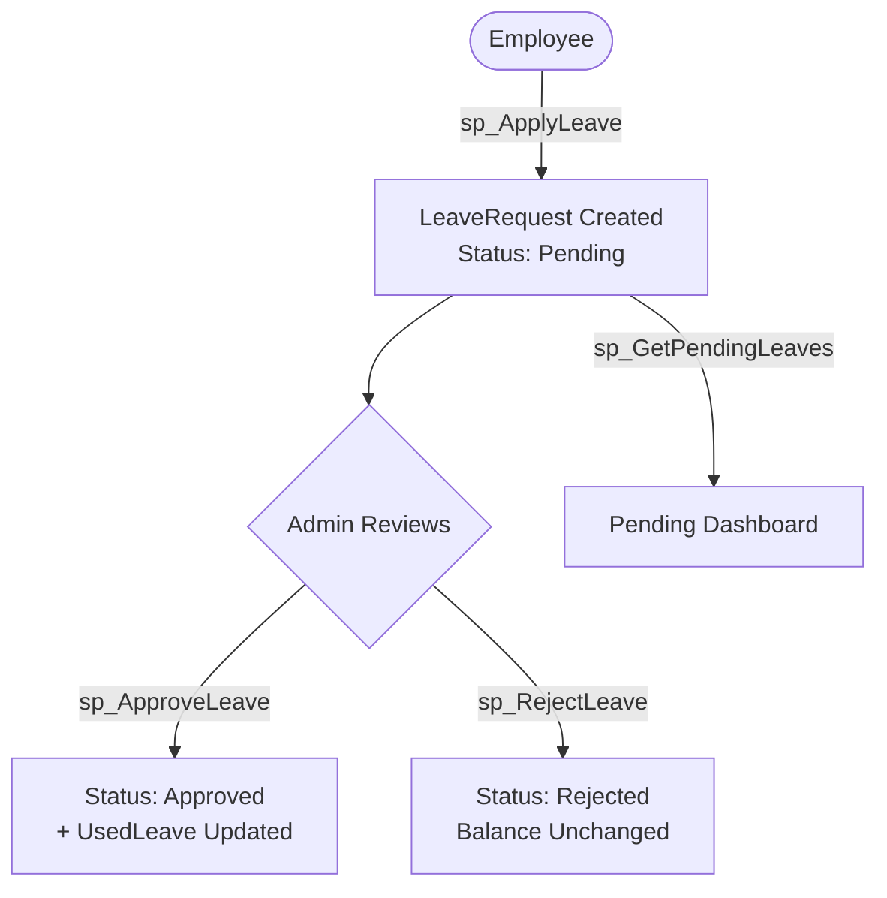

# ⚙️ Stored Procedures — Leave Management System

> Stored Procedures are **precompiled SQL statements** stored inside the database. They improve performance, reduce duplicate code, and make database operations reusable and secure.

---

## 📋 Table of Contents

- [Naming Convention](#naming-convention)
- [Procedure Overview](#procedure-overview)
- [1. Departments Procedures](#1-departments-table-procedures)
- [2. Employees Procedures](#2-employees-table-procedures)
- [3. LeaveTypes Procedures](#3-leavetypes-table-procedures)
- [4. LeaveRequests Procedures](#4-leaverequests-table-procedures)
- [5. LeaveBalances Procedures](#5-leavebalances-table-procedures)
- [Procedure Count Summary](#procedure-count-summary)

---

## Naming Convention

| Prefix       | Purpose              |
|--------------|----------------------|
| `sp_Insert`  | Insert / Add data    |
| `sp_Get`     | Retrieve / Read data |
| `sp_Update`  | Modify existing data |
| `sp_Delete`  | Remove data          |

---

## Procedure Overview



---

## 1. Departments Table Procedures

> Handles CRUD operations and reporting for the `Departments` table.

---

### 🟢 sp_InsertDepartment

**Purpose:** Adds a new department to the system.

```sql
CREATE OR ALTER PROCEDURE sp_InsertDepartment
    @DepartmentName VARCHAR(100)
AS
BEGIN
    INSERT INTO Departments (DepartmentName)
    VALUES (@DepartmentName)
END
```

| Parameter        | Type         | Description              |
|------------------|--------------|--------------------------|
| `@DepartmentName`| VARCHAR(100) | Name of new department   |

---

### 🔵 sp_GetDepartments

**Purpose:** Retrieves all department records.

```sql
CREATE OR ALTER PROCEDURE sp_GetDepartments
AS
BEGIN
    SELECT * FROM Departments
END
```

> No parameters required — returns the full `Departments` table.

---

### 🟡 sp_UpdateDepartment

**Purpose:** Updates the name of an existing department.

```sql
CREATE OR ALTER PROCEDURE sp_UpdateDepartment
    @DepartmentID   INT,
    @DepartmentName VARCHAR(100)
AS
BEGIN
    UPDATE Departments
    SET DepartmentName = @DepartmentName
    WHERE DepartmentID = @DepartmentID
END
```

| Parameter          | Type         | Description                   |
|--------------------|--------------|-------------------------------|
| `@DepartmentID`    | INT          | ID of department to update    |
| `@DepartmentName`  | VARCHAR(100) | New name for the department   |

---

### 🔴 sp_DeleteDepartment

**Purpose:** Deletes a department by its ID.

```sql
CREATE OR ALTER PROCEDURE sp_DeleteDepartment
    @DepartmentID INT
AS
BEGIN
    DELETE FROM Departments
    WHERE DepartmentID = @DepartmentID
END
```

| Parameter        | Type | Description                  |
|------------------|------|------------------------------|
| `@DepartmentID`  | INT  | ID of department to delete   |

---

### 📊 sp_DepartmentLeaveReport

**Purpose:** Displays total leave requests grouped by department.

```sql
CREATE OR ALTER PROCEDURE sp_DepartmentLeaveReport
AS
BEGIN
    SELECT
        d.DepartmentName,
        COUNT(lr.LeaveRequestID) AS TotalLeaves
    FROM Departments d
    INNER JOIN Employees e
        ON d.DepartmentID = e.DepartmentID
    INNER JOIN LeaveRequests lr
        ON e.EmployeeID = lr.EmployeeID
    GROUP BY d.DepartmentName
END
```

**Sample Output:**

| DepartmentName | TotalLeaves |
|----------------|-------------|
| HR             | 12          |
| IT             | 25          |
| Finance        | 8           |

> 💡 Uses two `INNER JOIN`s across `Departments → Employees → LeaveRequests` and groups by department name.

---

## 2. Employees Table Procedures

> Handles employee CRUD operations and leave-related queries.

---

### 🟢 sp_InsertEmployee

**Purpose:** Adds a new employee to the system.

```sql
CREATE OR ALTER PROCEDURE sp_InsertEmployee
    @FirstName    VARCHAR(50),
    @LastName     VARCHAR(50),
    @Email        VARCHAR(100),
    @Gender       VARCHAR(10),
    @HireDate     DATE,
    @DepartmentID INT
AS
BEGIN
    INSERT INTO Employees
        (FirstName, LastName, Email, Gender, HireDate, DepartmentID)
    VALUES
        (@FirstName, @LastName, @Email, @Gender, @HireDate, @DepartmentID)
END
```

| Parameter       | Type         | Description                    |
|-----------------|--------------|--------------------------------|
| `@FirstName`    | VARCHAR(50)  | Employee's first name          |
| `@LastName`     | VARCHAR(50)  | Employee's last name           |
| `@Email`        | VARCHAR(100) | Unique email address           |
| `@Gender`       | VARCHAR(10)  | Gender                         |
| `@HireDate`     | DATE         | Date of joining                |
| `@DepartmentID` | INT          | Department the employee joins  |

---

### 🔵 sp_GetEmployees

**Purpose:** Retrieves all employee records.

```sql
CREATE OR ALTER PROCEDURE sp_GetEmployees
AS
BEGIN
    SELECT * FROM Employees
END
```

---

### 🟡 sp_UpdateEmployee

**Purpose:** Updates full details of an existing employee.

```sql
CREATE OR ALTER PROCEDURE sp_UpdateEmployee
    @EmployeeID   INT,
    @FirstName    VARCHAR(50),
    @LastName     VARCHAR(50),
    @Email        VARCHAR(100),
    @Gender       VARCHAR(10),
    @HireDate     DATE,
    @DepartmentID INT
AS
BEGIN
    UPDATE Employees
    SET
        FirstName    = @FirstName,
        LastName     = @LastName,
        Email        = @Email,
        Gender       = @Gender,
        HireDate     = @HireDate,
        DepartmentID = @DepartmentID
    WHERE EmployeeID = @EmployeeID
END
```

| Parameter       | Type         | Description                  |
|-----------------|--------------|------------------------------|
| `@EmployeeID`   | INT          | Target employee to update    |
| *(rest)*        | —            | Same as Insert parameters    |

---

### 🔴 sp_DeleteEmployee

**Purpose:** Deletes an employee record by ID.

```sql
CREATE OR ALTER PROCEDURE sp_DeleteEmployee
    @EmployeeID INT
AS
BEGIN
    DELETE FROM Employees
    WHERE EmployeeID = @EmployeeID
END
```

---

### 📋 sp_EmployeeLeaveHistory

**Purpose:** Retrieves the full leave history for a specific employee.

```sql
CREATE OR ALTER PROCEDURE sp_EmployeeLeaveHistory
    @EmployeeID INT
AS
BEGIN
    SELECT
        lr.LeaveRequestID,
        lt.LeaveTypeName,
        lr.StartDate,
        lr.EndDate,
        lr.TotalDays,
        lr.Status
    FROM LeaveRequests lr
    INNER JOIN LeaveTypes lt
        ON lr.LeaveTypeID = lt.LeaveTypeID
    WHERE lr.EmployeeID = @EmployeeID
END
```

| Parameter     | Type | Description                         |
|---------------|------|-------------------------------------|
| `@EmployeeID` | INT  | Employee whose history to retrieve  |

> 💡 Joins `LeaveRequests` with `LeaveTypes` to show leave category names alongside request details.

---

### 💰 sp_GetEmployeeLeaveBalance

**Purpose:** Retrieves the leave balance for a specific employee.

```sql
CREATE OR ALTER PROCEDURE sp_GetEmployeeLeaveBalance
    @EmployeeID INT
AS
BEGIN
    SELECT * FROM LeaveBalances
    WHERE EmployeeID = @EmployeeID
END
```

| Parameter     | Type | Description                         |
|---------------|------|-------------------------------------|
| `@EmployeeID` | INT  | Employee whose balance to retrieve  |

---

## 3. LeaveTypes Table Procedures

> Handles CRUD operations for leave categories (e.g., Sick Leave, Casual Leave).

---

### 🟢 sp_InsertLeaveType

**Purpose:** Adds a new leave category.

```sql
CREATE OR ALTER PROCEDURE sp_InsertLeaveType
    @LeaveTypeName VARCHAR(50),
    @MaxDays       INT,
    @IsPaid        BIT
AS
BEGIN
    INSERT INTO LeaveTypes (LeaveTypeName, MaxDays, IsPaid)
    VALUES (@LeaveTypeName, @MaxDays, @IsPaid)
END
```

| Parameter        | Type        | Description                           |
|------------------|-------------|---------------------------------------|
| `@LeaveTypeName` | VARCHAR(50) | Name of the leave type                |
| `@MaxDays`       | INT         | Maximum allowed days per year         |
| `@IsPaid`        | BIT         | `1` = Paid Leave, `0` = Unpaid Leave  |

---

### 🔵 sp_GetLeaveTypes

**Purpose:** Retrieves all leave categories.

```sql
CREATE OR ALTER PROCEDURE sp_GetLeaveTypes
AS
BEGIN
    SELECT * FROM LeaveTypes
END
```

---

### 🟡 sp_UpdateLeaveType

**Purpose:** Updates an existing leave category.

```sql
CREATE OR ALTER PROCEDURE sp_UpdateLeaveType
    @LeaveTypeID   INT,
    @LeaveTypeName VARCHAR(50),
    @MaxDays       INT,
    @IsPaid        BIT
AS
BEGIN
    UPDATE LeaveTypes
    SET
        LeaveTypeName = @LeaveTypeName,
        MaxDays       = @MaxDays,
        IsPaid        = @IsPaid
    WHERE LeaveTypeID = @LeaveTypeID
END
```

---

### 🔴 sp_DeleteLeaveType

**Purpose:** Deletes a leave category by ID.

```sql
CREATE OR ALTER PROCEDURE sp_DeleteLeaveType
    @LeaveTypeID INT
AS
BEGIN
    DELETE FROM LeaveTypes
    WHERE LeaveTypeID = @LeaveTypeID
END
```

---

## 4. LeaveRequests Table Procedures

> Handles the full leave request lifecycle: apply → approve/reject → track.

---

### 🟢 sp_ApplyLeave

**Purpose:** Creates a new leave request for an employee.

```sql
CREATE OR ALTER PROCEDURE sp_ApplyLeave
    @EmployeeID  INT,
    @LeaveTypeID INT,
    @StartDate   DATE,
    @EndDate     DATE,
    @TotalDays   INT,
    @Reason      VARCHAR(300)
AS
BEGIN
    INSERT INTO LeaveRequests
        (EmployeeID, LeaveTypeID, StartDate, EndDate, TotalDays, Reason)
    VALUES
        (@EmployeeID, @LeaveTypeID, @StartDate, @EndDate, @TotalDays, @Reason)
END
```

| Parameter      | Type         | Description                      |
|----------------|--------------|----------------------------------|
| `@EmployeeID`  | INT          | Employee applying for leave      |
| `@LeaveTypeID` | INT          | Type of leave being applied for  |
| `@StartDate`   | DATE         | Leave start date                 |
| `@EndDate`     | DATE         | Leave end date                   |
| `@TotalDays`   | INT          | Number of leave days             |
| `@Reason`      | VARCHAR(300) | Reason for the leave             |

> 💡 `Status` defaults to `'Pending'` and `AppliedDate` is auto-set via `GETDATE()` — no manual input needed.

---

### 🔵 sp_GetLeaveRequests

**Purpose:** Retrieves all leave requests.

```sql
CREATE OR ALTER PROCEDURE sp_GetLeaveRequests
AS
BEGIN
    SELECT * FROM LeaveRequests
END
```

---

### 🟡 sp_UpdateLeaveRequest

**Purpose:** Updates the status of a leave request (manual override).

```sql
CREATE OR ALTER PROCEDURE sp_UpdateLeaveRequest
    @LeaveRequestID INT,
    @Status         VARCHAR(20)
AS
BEGIN
    UPDATE LeaveRequests
    SET Status = @Status
    WHERE LeaveRequestID = @LeaveRequestID
END
```

| Parameter         | Type        | Description                               |
|-------------------|-------------|-------------------------------------------|
| `@LeaveRequestID` | INT         | Request to update                         |
| `@Status`         | VARCHAR(20) | New status: `Pending`, `Approved`, `Rejected` |

---

### 🔴 sp_DeleteLeaveRequest

**Purpose:** Deletes a leave request by ID.

```sql
CREATE OR ALTER PROCEDURE sp_DeleteLeaveRequest
    @LeaveRequestID INT
AS
BEGIN
    DELETE FROM LeaveRequests
    WHERE LeaveRequestID = @LeaveRequestID
END
```

---

### ✅ sp_ApproveLeave

**Purpose:** Approves a leave request **and** automatically updates the employee's leave balance.

```sql
CREATE OR ALTER PROCEDURE sp_ApproveLeave
    @LeaveRequestID INT,
    @EmployeeID     INT,
    @LeaveTypeID    INT,
    @Days           INT
AS
BEGIN
    -- Step 1: Approve the request
    UPDATE LeaveRequests
    SET Status = 'Approved'
    WHERE LeaveRequestID = @LeaveRequestID

    -- Step 2: Deduct days from leave balance
    UPDATE LeaveBalances
    SET UsedLeave = UsedLeave + @Days
    WHERE EmployeeID  = @EmployeeID
      AND LeaveTypeID = @LeaveTypeID
END
```

| Parameter          | Type | Description                              |
|--------------------|------|------------------------------------------|
| `@LeaveRequestID`  | INT  | Request to approve                       |
| `@EmployeeID`      | INT  | Employee whose balance to update         |
| `@LeaveTypeID`     | INT  | Leave type to deduct from               |
| `@Days`            | INT  | Number of days to add to `UsedLeave`     |

> ⚡ **Key Procedure** — performs **two UPDATE statements** in one call:
> 1. Marks the request as `'Approved'`
> 2. Increments `UsedLeave` in `LeaveBalances` (which auto-recalculates `RemainingLeave`)

---

### ❌ sp_RejectLeave

**Purpose:** Rejects a leave request. Does not affect leave balance.

```sql
CREATE OR ALTER PROCEDURE sp_RejectLeave
    @LeaveRequestID INT
AS
BEGIN
    UPDATE LeaveRequests
    SET Status = 'Rejected'
    WHERE LeaveRequestID = @LeaveRequestID
END
```

| Parameter          | Type | Description            |
|--------------------|------|------------------------|
| `@LeaveRequestID`  | INT  | Request to reject      |

---

### ⏳ sp_GetPendingLeaves

**Purpose:** Retrieves all leave requests that are still pending approval.

```sql
CREATE OR ALTER PROCEDURE sp_GetPendingLeaves
AS
BEGIN
    SELECT * FROM LeaveRequests
    WHERE Status = 'Pending'
END
```

> Useful for admin dashboards to quickly view unprocessed requests.

---

## 5. LeaveBalances Table Procedures

> Handles CRUD operations for employee leave balance records.

These follow the same pattern as above:

| Procedure                   | Purpose                                 |
|-----------------------------|-----------------------------------------|
| `sp_InsertLeaveBalance`     | Allocate leave balance to an employee   |
| `sp_GetLeaveBalance`        | Retrieve balance for an employee        |
| `sp_UpdateLeaveBalance`     | Modify allocated or used leave          |
| `sp_DeleteLeaveBalance`     | Remove a leave balance record           |

> 💡 `RemainingLeave` is a **computed column** (`TotalLeave - UsedLeave`) — it updates automatically when `UsedLeave` is changed via `sp_ApproveLeave`.

---

## Procedure Count Summary

| Category               | Count |
|------------------------|-------|
| CRUD Procedures        | 20    |
| Additional / Reporting | 6     |
| **Total**              | **26**|

### Breakdown by Table

| Table           | CRUD | Additional                                        | Total |
|-----------------|------|---------------------------------------------------|-------|
| `Departments`   | 4    | `sp_DepartmentLeaveReport`                        | 5     |
| `Employees`     | 4    | `sp_EmployeeLeaveHistory`, `sp_GetEmployeeLeaveBalance` | 6 |
| `LeaveTypes`    | 4    | —                                                 | 4     |
| `LeaveRequests` | 4    | `sp_ApplyLeave`, `sp_ApproveLeave`, `sp_RejectLeave`, `sp_GetPendingLeaves` | 7 |
| `LeaveBalances` | 4    | —                                                 | 4     |
| **Total**       | **20** | **6**                                           | **26**|

---

## Leave Request Flow



---

> 📌 **Tech Stack:** SQL Server (T-SQL) | **Diagrams:** Mermaid  
> 📁 Part of the Leave Management System teaching series.
